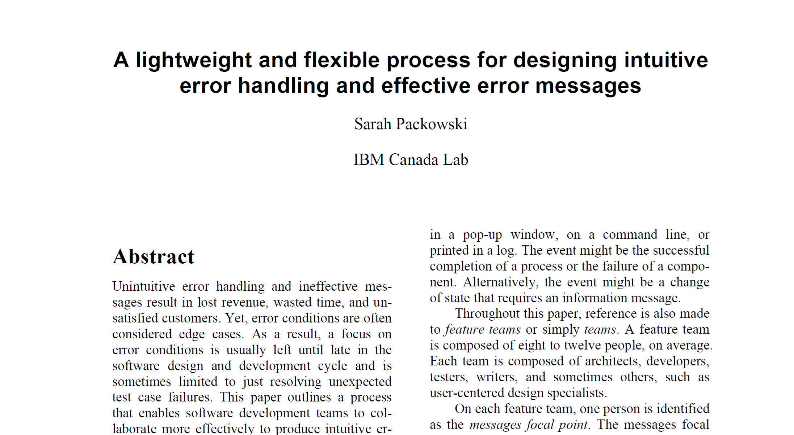

# A lightweight and flexible process for designing intuitive error handling and effective error messages

Sarah Packowski ( spackows@ca.ibm.com )

This paper was presented at the CASCON conference in Toronto, Ontario, Canada, in 2009.

[Messages_CASCON_2009.pdf](Messages_CASCON_2009.pdf)

